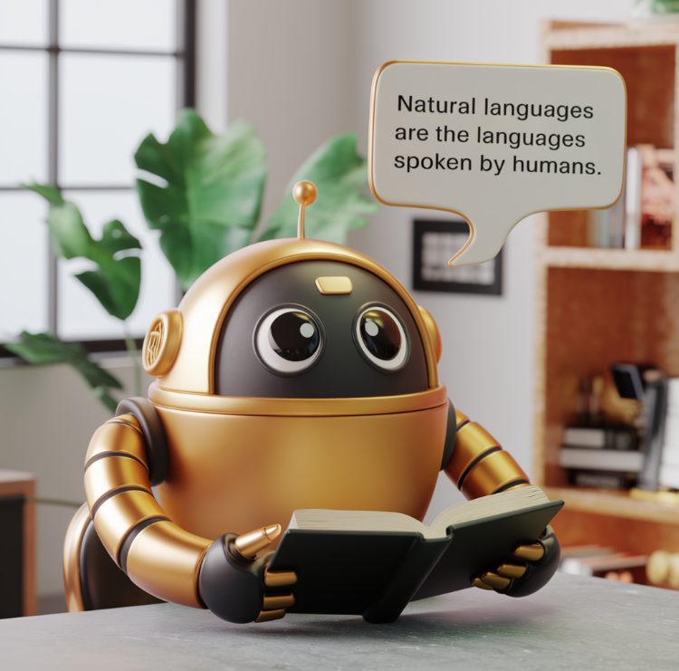

# Natural Language Processing: Zero to Hero!
 
Welcome to Theory and Hands-on experience of NLP.

In this repository, I've covered almost everything that you need to get started in the world of NLP, starting from Tokenizers to the Transformer Architecuture. By the time you finish this, you will have a solid grasp over the core concepts of NLP.

The motive of this repository is to give you the core intuition and by the end of this you'll know how things evolved over the years and why they are the way they are.

*Image Generated by Ideogram*

# Table of Contents
### 1. [Tokenization](./Notebooks/01_Tokenization.ipynb)
### 2. [Preprocessing](./Notebooks/02_Pre_Processing.ipynb)
### 3. [Bag of Words and Similarity](./Notebooks/03_BOW_Similarity.ipynb)
### 4. [TF-IDF and Document Search](./Notebooks/04_TFIDF_DocSearch.ipynb)
### 5. [Naive Bayes Text Classification](./Notebooks/05_NaiveBayes_TextClf.ipynb)
### 6. [LDA Topic Modelling](./Notebooks/06_LDA_TopicModelling.ipynb)
### 7. [Word Embeddings](./Notebooks/07_Word_Embeddings.ipynb)
### 8. [Recurrent Neural Networks (RNNs) and Language Modelling](./Notebooks/08_RNNs_LMs.ipynb)
### 9. [Machine Translation and Attention](./Notebooks/09_Machine_Translation_Attention.ipynb)
### 10. [Transformers](./Notebooks/10_Transformers.ipynb)

# How do I use this repository?
* Considering the computational power required for ML and DL, it is advised to use Google Colab or Kaggle Kernels.
* You can click on  to open the notebook in Colab.
* You can click on  to open the notebook in Kaggle.
* For some of the notebooks, Kaggle datasets are used, and some of them are in Gigabytes.
* For quicker loading of those datasets, it is advised to open them in Kaggle using corresponding tags.
* Opening the Kaggle Kernel does not directly attach the dataset required for the notebook.
* You are required to attach the dataset whose link has been provided in the respective notebooks, which you will find as you progress through them.
* Start with the `Tokenization` Notebook and move forward sequentially.
* Take your time to understand the concepts and code. It is specifically designed to be easy to understand and to be done at your own pace.
* Make sure you have a basic understanding of Python programming before starting.
* If you encounter any issues or have questions, feel free to open an issue in the GitHub repository.
* Don't forget to star the repository if you find it helpful!

# Contributing
You are more than welcome to contribute to this repository. You can start by opening an issue or submitting a pull request. If you have any questions, feel free to reach out to me on [X](https://x.com/sujay_kapadnis)

If you have any resources that you think would be helpful for others, feel free to open an issue or submit a pull request.

# License
This project is licensed under the MIT License - see the [LICENSE](LICENSE) file for details.

